# Power BI Project (PBIP) fundamentals

Welcome to this lab where you'll get hands-on experience with the **Power BI Project (PBIP)** format. This workshop is designed to help you understand and manipulate the PBIP folder structure, publish to workspace and  working with **TMDL** and **PBIR** files.

## 🛠️ Prerequisites


* Enable the following **Power BI Desktop** preview features:
  * Power BI Project (.pbip) save option
  * Store semantic model using TMDL format
  * Store reports using enhanced metadata format (PBIR)
  
* Ensure you have the following Visual Studio Code extensions
  * [TMDL extension](https://marketplace.visualstudio.com/items?itemName=analysis-services.TMDL)
  * [Microsoft Fabric extension](https://marketplace.visualstudio.com/items?itemName=fabric.vscode-fabric)
  * [Microsoft PowerShell](https://marketplace.visualstudio.com/items?itemName=ms-vscode.PowerShell)


## 1. Save a PBIX to PBIP Format

✅ **Goal**: Save your report as a PBIP project.

### Steps

1. Open [resources/Sales.pbix](resources/Sales.pbix) in **Power BI Desktop**.
   
> [!IMPORTANT]
> * If you downloaded the repo code as a ZIP file, the PBIX file won't be included because it's managed with Git LFS. To get the PBIX, please download it directly from the repository and replace the local file. [Download Sales.pbix](https://github.com/RuiRomano/workshops-pbinextstep2025/raw/refs/heads/main/labs/lab1/resources/Sales.pbix?download=)
> * This PBIX file uses mock data sourced from CSV files hosted in a public location. When prompted for authentication, select **Anonymous** - the data should refresh without any errors.

2. Go to **File > Save As**.
3. Choose a folder (e.g. `c:\temp\lab1`) and select **Save as type**: `Power BI Project Files (*.pbip)`
4. Name it: `Sales.pbip`
5. **Power BI Desktop** now saves your work as a PBIP folder instead of a single PBIX file.
6. You can recognize a Power BI Project by the **expanded title bar** in Desktop, which allows you to identify and open the associated folder directly in Windows Explorer.

    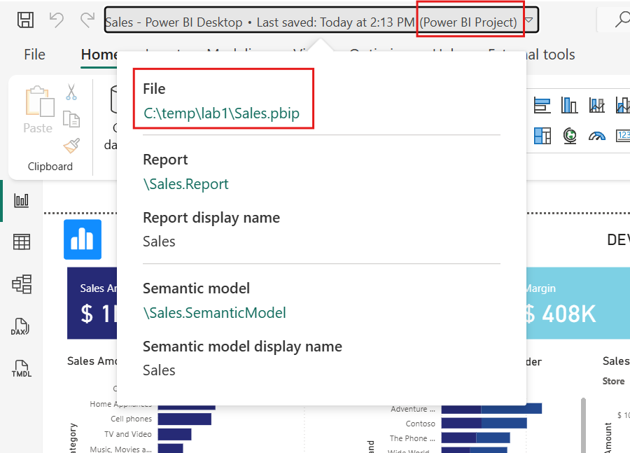
7. Although **Power BI Desktop** presents the experience as if you're working with a single file, you're actually editing two distinct components: the report and the semantic model, each stored in its own folder within the PBIP structure.
   
    ```text
    PBIP/
    ├── Sales.Report/
    ├── Sales.SemanticModel/
    ├── .gitignore
    └── Sales.pbip
    ```

## 2. Explore PBIP files and folders

✅ **Goal**: Understand how Power BI Project is organized and its key files and folders.

### Steps

1. Open **Visual Studio Code**
2. Go to **File > Open Folder...** and open the saved PBIP folder.
3. Open and explore the following key files and folders:
   
    | File/Folder                            | Description |
    |----------------------------------------|-------------|
    | `*.pbip`                               | Main entry point file for **Power BI Desktop**. Includes a reference to the Report folder. **Optional** file; **Power BI Desktop** can also open a report by opening the `definition.pbir`. |
    | `*.Report/definition.pbir`             | Contains the overall report definition and key configuration settings such as folder version. Includes a reference to the **semantic model** — typically via a **relative byPath reference**, but can also use an **absolute byConnection reference** to connect to a model hosted in Fabric. |
    | `*.Report/definition`                  | Contains the report definition in [**PBIR format**](https://learn.microsoft.com/en-us/power-bi/developer/projects/projects-report?tabs=v2%2Cdesktop#pbir-format), where each report object (pages, visuals, bookmarks, etc.) is organized into its own **folders** and **JSON files**. |
    | `*.SemanticModel/definition`           | Contains the semantic model definition in [**TMDL file format**](https://learn.microsoft.com/en-us/power-bi/developer/projects/projects-dataset#tmdl-format), where each semantic model object (tables, roles, cultures, etc.) is organized into its own **folders** and **TMDL documents** using the [**TMDL language**](https://learn.microsoft.com/en-us/analysis-services/tmdl/tmdl-overview?view=sql-analysis-services-2025). |
    | `*.SemanticModel/.platform`           | Fabric platform file for the semantic model. Contains properties such as `displayName`, `description`, and `logicalId` (required for deployment and Fabric Git integration). |
    | `*.Report/.platform`                  | Same as the semantic model `.platform` file, but the `displayName` property is also used to define the **Power BI Desktop** window title. |
    | `*.SemanticModel/.pbi/cache.abf`      | A **local cached copy** of the semantic model’s data stored as an Analysis Services Backup File (ABF). Acts as a **user-specific cache** and **should not be shared** via Git. **Power BI Desktop** can open the PBIP without it, but the model will be empty, requiring a data refresh. You can safely drop this file whenever you wish to share your development without compromising the data in it.|
4. Each file includes a `$schema` property at the top of the JSON document, which specifies the document's version. This property also helps clarify the meaning of other properties and can assist in detecting syntax errors when editing the files manually.

    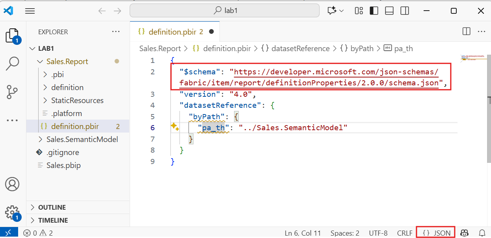

    Learn more about PBIP JSON schemas in the [documentation](https://learn.microsoft.com/en-us/power-bi/developer/projects/projects-overview#json-file-schemas).

> [!IMPORTANT]
> * Simply being able to explore PBIP files using a file explorer or code editor is a significant advantage. For example, you no longer need to wait minutes for **Power BI Desktop** to open a PBIX just to review a measure's DAX code or to confirm which database your semantic model is connected to by inspecting a table's Power Query code - Just opent he files and look at the code!
> * All files and folders are documented in [PBIP documentation](https://learn.microsoft.com/en-us/power-bi/developer/projects/projects-overview) including references to their public [JSON-schemas](https://github.com/microsoft/json-schemas/tree/main/fabric). 
  

## 3. Create new report from a template

✅ **Goal**: Create a new report from copying a report template folder.

### Steps

1. Copy the [`resources/templateReport`](resources/templateReport/) folder to the previously saved PBIP folder and rename the folder to `NewReport.Report`
   
   You should end up with a folder structure like:

    ```text    
    Lab1/
    ├── NewReport.Report/
    ├── Sales.Report/
    ├── Sales.SemanticModel/
    ├── .gitignore
    └── Sales.pbip
    ```

> [!TIP]
> The template report uses descriptive folder names for pages and visuals. By default, new report objects like pages are saved with unique IDs by **Power BI Desktop**, but you can rename these folders to use meaningful names for easier navigation and source code management.
> 

2. Ensure the `NewReport.Report/definition.pbir` has a valid relative reference to `Sales.SemanticModel` in the `byPath` property. 


> [!TIP]
> The PBIP format supports multiple reports and semantic models within a single folder, similar to a Fabric workspace. You can manage several reports and models together, and it's not necessary to have a separate `.pbip` file for each report - each report can be opened directly from its `.pbir` file inside its respective report folder.
   
3. Choose a theme file from [`resources/themes`](resources/themes/) and copy its contents into `NewReport.Report/StaticResources/RegisteredResources/theme.json` file within your new report folder.
4. Open `NewReport.Report/definition.pbir` with **Power BI Desktop**.
5. Since this is a template report, it contains placeholder visuals. But also opens the **Sales** semantic model for editing.
   
6. Configure the visual placeholders with semantic model fields and build a report similar to the following:
   
7. Observe it's using the colors of the theme you picked.
> [!TIP]
> One of the key benefits of the PBIP format is the ability to customize reports, pages, or visuals using straightforward file operations before opening them in **Power BI Desktop**. This makes it easy to create reusable templates for your development workflows.
1. Save the report in **Power BI Desktop**, observe that `.platform` file is automatically generated in the report folder.
2.  Create a new page with some visuals, save your changes, and observe that a new page folder is created inside the report `definition` folder.

## 4. Connect a report to a semantic model in service

✅ **Goal**: Publish PBIP from **Power BI Desktop** and connect report to semantic model in workspace.

### Steps

1. Create a new workspace in Fabric, give it a name like `Workshop - Lab 1`
2. Publish the new report to the workspace using **Power BI Desktop** **Publish** option.
   
3. The workspace should now have a new report and semantic model inside.
   
> [!TIP]
> Notice that the semantic model was published with same name of the report even though the semantic model `.platform` file has a different `displayName`. This is by-design because currently **Power BI Desktop** **Publish** operation is using a PBIX behind the scenes. 

4. Open the workspace and grab the following attributes:
    * Workspace and semantic model names
        
    * Semantic model ID
    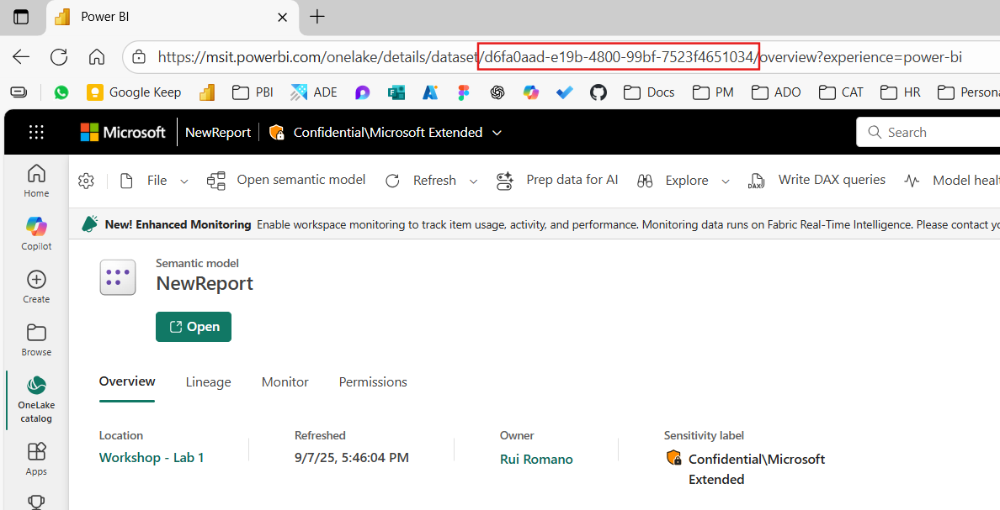
5. Go back to Visual Studio Code and create a new file `definition-live.pbir` inside `NewReport.Report/` folder with the following content:
   
    Replace the placeholders `[WorkspaceName]`, `[SemanticModelName]` and `[SemanticModelId]` with the attributes from previous step.

    ```json
    {
        "$schema": "https://developer.microsoft.com/json-schemas/fabric/item/report/definitionProperties/2.0.0/schema.json",
        "version": "4.0",
        "datasetReference": {
            "byConnection": {      
                "connectionString": "Data Source=\"powerbi://api.powerbi.com/v1.0/myorg/[WorkpaceName]\";initial catalog=[SemanticModelName];access mode=readonly;integrated security=ClaimsToken;semanticmodelid=[SemanticModelId]"
            }
        }
    }
    ```

    The report folder should now include two `*.pbir` files:

    ```text    
    PBIP/
    ├── NewReport.Report/
    |   ├── definition/
    |   ├── definition-live.pbir
    |   └── definition.pbir
    ```

> [!TIP]
> * `byConnection` Specifies a connection to a semantic model in a Fabric workspace by using a connection string. When a byConnection reference is used, **Power BI Desktop** open the report in **Live Connect** mode therefore the semantic model is not opened for edit.
> * More details about `definition.pbir` file in [documentation](https://learn.microsoft.com/en-us/power-bi/developer/projects/projects-report?tabs=v2%2Cdesktop#definitionpbir).

6. Open the `definition-live.pbir` with **Power BI Desktop** and notice that now the semantic model is not opened for edit but instead the report is **Live Connected** to the semantic model in the Fabric workspace.

    

> [!TIP]
> Including multiple *.pbir files is especially useful when switching between a local semantic model and a published one, allowing flexibility in development and testing. 
    
## 5. Copy semantic model objects using TMDL files

✅ **Goal**: Create a time intelligence calculation group by copying the TMDL file to the semantic model definition folder.

### Steps

1. Copy the [`resources/tmdl/Time Intelligence.tmdl`](resources/tmdl/Time%20Intelligence.tmdl) TMDL file to the `Sales.SemanticModel\definition\tables` folder.
2. If you currently have Sales.pbip open in **Power BI Desktop**, please close it.
> [!TIP]
> Currently, **Power BI Desktop** does not detect changes made to PBIP files using external tools or code editors. If you modify any PBIP file and want to see those changes reflected in **Power BI Desktop**, you must close and reopen the PBIP project.
3. Open `Sales.pbip` in **Power BI Desktop** and verify that the semantic model now includes the new **Time Intelligence** calculation group table. A refresh may be required.
   
   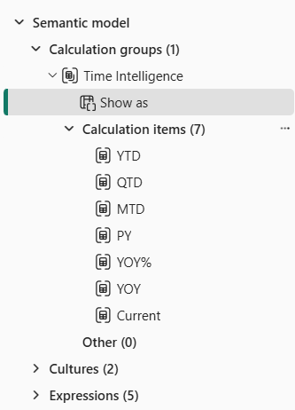
   
> [!TIP]
> The **TMDL folder structure makes it easy to reuse and collaborate on semantic models**. You can maintain shared model components (e.g. calendar tables, calculation groups, roles,...) and quickly apply them to multiple semantic models by copying files between definitions.

## 6. Publish from Visual Studio Code

✅ **Goal**: Publish report and semantic model from Visual Studio Code using [Microsoft Fabric extension](https://marketplace.visualstudio.com/items?itemName=fabric.vscode-fabric).

### Steps

1. Open Visual Studio Code and navigate to the **Microsoft Fabric extension**.
   

> [!TIP]
> You can use the [**Switch tenant**](https://github.com/microsoft/vscode-fabric?tab=readme-ov-file#switch-tenants) feature to connect with different account.

2. Filter the workshop workspace.
    
    

3. Explore the items in the workspace in Visual Studio Code
   
   

4. Go to **File > Open Folder...** and open the saved PBIP folder.
5. In the Microsoft Fabric extension, expand the "Local folder" node and confirm that each Report (*.Report) and SemanticModel (*.SemanticModel) folder from your PBIP folder is listed in the tree-view.
   
   

6. Right-click the `Sales` semantic model, select **Publish > To specific workspace...** and pick a Fabric workspace - the filtered workspace should appear in the top.
   
   
   
   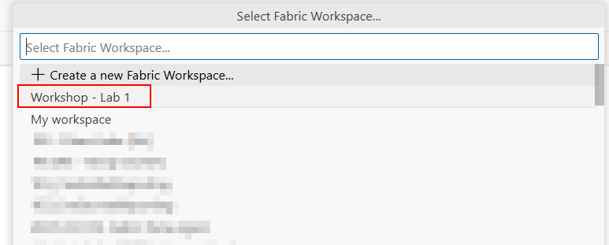

    Look for the operation status in the bottom right corner:

    

7. Confirm if the semantic model got published to the workspace.
8. Repeat the publish operation for the Report. 
   
    Power BI reports must be connected to a semantic model; during publishing the process prompts to select the target semantic model in the workspace that the report will connect to.

   

> [!TIP]
> By default the extension show all the semantic models in the selected workspace, but you have the option to select to a semantic model in a different workspace.

> [!IMPORTANT]
> * When you publish from Visual Studio Code, the **Microsoft Fabric extension only publishes the definition (metadata)** - it does not publish the semantic model data. The extension uses the [Fabric REST CRUD APIs](https://learn.microsoft.com/en-us/rest/api/fabric/articles/item-management/item-management-overview) to deploy the PBIP semantic model or report definition files. 
>* This approach not only gives you flexibility in choosing what to publish - whether just the report or only the semantic model - but also significantly **boosts development efficiency**. For example, when making a simple update like fixing a DAX measure, you can skip publishing both metadata and data, and avoid waiting for a semantic model refresh in the service.
 
## 7. Get item definition from workspace using Visual Studio Code

✅ **Goal**: Download item definitions from workspace.

### Steps

1. Open the workshop workspace in Fabric.
2. Create a new report from a semantic model in the workspace.
   
3. Save the report and name it `NewReportFromService`
4. Open **Microsoft Fabric extension** in Visual Studio Code and navigate to the workspace.
5. Right-click the report `NewReportFromService` and select **Open in Explorer**
   
6. If successfull, Visual Studio Code will open the downloaded item folder
7. Go to windows explorer and open the `NewReportFromService.Report/definition.pbir` file with **Power BI Desktop**
   
> [!TIP]
> By design when downloading the definition of a report, it always downloads with a `byConnection` configuration in `definition.pbir`. But you can easily change it to a `byPath` and target a local semantic model folder.

8. Repeat the previous steps, now to download a semantic model from a workspace.

> [!IMPORTANT]
> **This download item approach offers significant usability benefits, especially when you need to retrieve the definition of a report or semantic model that is blocked by the standard [Download PBIX feature](https://learn.microsoft.com/en-us/power-bi/create-reports/service-export-to-pbix)**. Unlike the PBIX download, which has limitations - such as not supporting semantic models with incremental refresh - this method is not restricted by those constraints and allows for more flexible access to report components.

## 8. Edit semantic model using TMDL

✅ **Goal**: Edit a semantic model using TMDL language.

### Steps

1. Close **Power BI Desktop**.
2. Open **Visual Studio Code**
3. Go to **File > Open Folder...** and open the PBIP folder.
4. Open file `Sales.SemanticModel/definition/tables/Sales.tmdl`
5. Notice the TMDL code readability features provided by TMDL extension:
   * **Code highlighting** - Easily identify different elements of TMDL code: types, values, expresions
    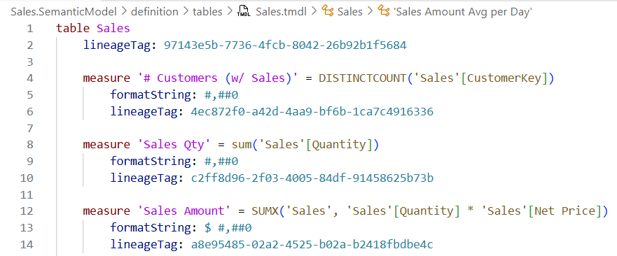
   *  **Breadcrumb navigation** - Easily navigate between TMDL files and objects
    
   * **Code formatting** - Keep your TMDL code clean and consistent
    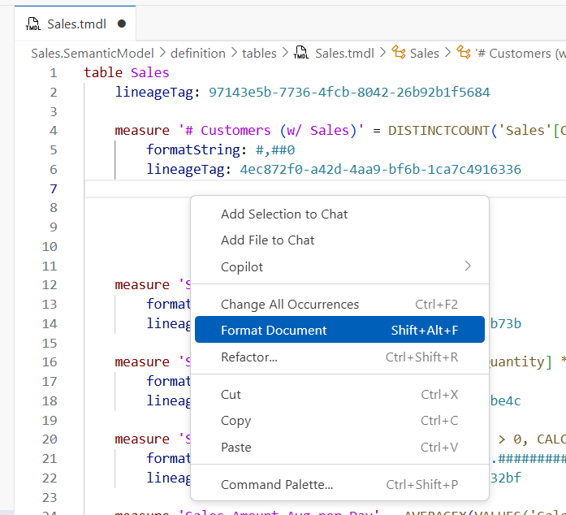
6. Create two new measures by duplicating the code of the measure `Sales Qty`
 
    The TMDL code should look like the following:

     ```TMDL
    table Sales
        ...
        measure 'Sales Qty' = sum('Sales'[Quantity])
            formatString: #,##0
            lineageTag: c2ff8d96-2f03-4005-84df-91458625b73b
        measure 'Sales Qty' = sum('Sales'[Quantity])
            formatString: #,##0
            lineageTag: c2ff8d96-2f03-4005-84df-91458625b73b
        measure 'Sales Qty' = sum('Sales'[Quantity])
            formatString: #,##0
            lineageTag: c2ff8d96-2f03-4005-84df-91458625b73b
        ...
     ```
7. Notice that the TMDL extension highlights errors with red squiggles. You can also view a list of problems in the Problems pane - go to **View > Problems**.

    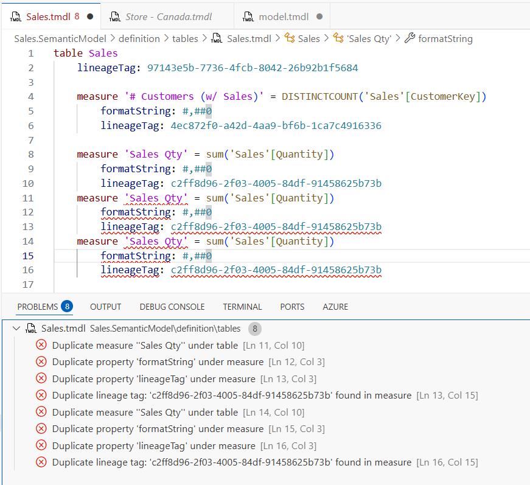
   
8. Rename the new measures to `Sales Qty (LY)` and `Sales Qty Avg per Day` and change the DAX expression accordingly.

    TMDL code should look like the following:

    ```TMDL
    table Sales
        ...
        measure 'Sales Qty' = sum('Sales'[Quantity])
            formatString: #,##0
            lineageTag: c2ff8d96-2f03-4005-84df-91458625b73b
        
        measure 'Sales Qty (LY)' = IF ([Sales Qty] > 0, CALCULATE([Sales Qty], SAMEPERIODLASTYEAR('Calendar'[Date])))
            formatString: #,##0
            lineageTag: c2ff8d96-2f03-4005-84df-91458625b73b
        
        measure 'Sales Qty Avg per Day' = AVERAGEX(VALUES('Calendar'[Date]), [Sales Qty])
            formatString: #,##0
            lineageTag: c2ff8d96-2f03-4005-84df-91458625b73b
        ...
     ```
9. The TMDL extension will highlight an error when a duplicate lineage tag is detected. Lineage tags must be unique within their scope — for example, two measures in the same table cannot share the same tag. Fix this by either entering a new unique identifier in the `lineageTag` property or using the TMDL extension’s code action to generate a new lineage tag automatically.

    

    Learn more about lineage tags in [documentation](https://learn.microsoft.com/en-us/analysis-services/tom/lineage-tags-for-power-bi-semantic-models?view=sql-analysis-services-2025).

10. Configure the `displayFolder` property on the three measures with value "Qty". You can use the [`ALT+Click`](https://code.visualstudio.com/docs/editing/codebasics#_multiple-selections-multicursor) to edit multiple lines at once.
    
    Notice the IntelliSense help while you type the property name:

    

    TMDL code should look like the following (note: your lineage tags should be different):

    ```TMDL
    table Sales
        ...
        measure 'Sales Qty' = sum('Sales'[Quantity])
            formatString: #,##0
            lineageTag: c2ff8d96-2f03-4005-84df-91458625b73b
            displayFolder: Qty
        measure 'Sales Qty (LY)' = IF ([Sales Qty] > 0, CALCULATE([Sales Qty], SAMEPERIODLASTYEAR('Calendar'[Date])))
            formatString: #,##0
            lineageTag: 01992909-efd5-72c9-9746-d811874a1677
            displayFolder: Qty
        measure 'Sales Qty Avg per Day' = AVERAGEX(VALUES('Calendar'[Date]), [Sales Qty])
            formatString: #,##0
            lineageTag: 0199290c-54fe-747c-8ddf-c496eafd0d88
            displayFolder: Qty
        ...
     ```

> [!TIP]
> You can force IntelliSense by pressing `CTRL+SPACE` inside any TMDL object, TMDL extension will show the available objects and properties for that object. 

11. Save the TMDL file in Visual Studio Code and open the `Sales.pbip` with **Power BI Desktop** to confirm and test the new created measures.

> [!IMPORTANT]
> While this example was simple, it demonstrates the potential of direct TMDL editing for large code changes or simple refactorings. You can take advantage of everything code editors offer, such as keyboard shortcuts, code duplication with copy & paste, advanced find-and-replace with regular expressions, programmatic edits, and more.
  
## 9. Edit Report using PBIR

✅ **Goal**: Map a report object to a PBIR file, identify changes and batch apply to others using PBIR files.

### Steps

1. Open Sales.pbip with **Power BI Desktop**.
2. Go to **File > Options and settings > Options > Report settings** and enable **Copy object names when right clicking on report objects**
   
3. In the `Sales` page, hide the title from the first bar chart.
   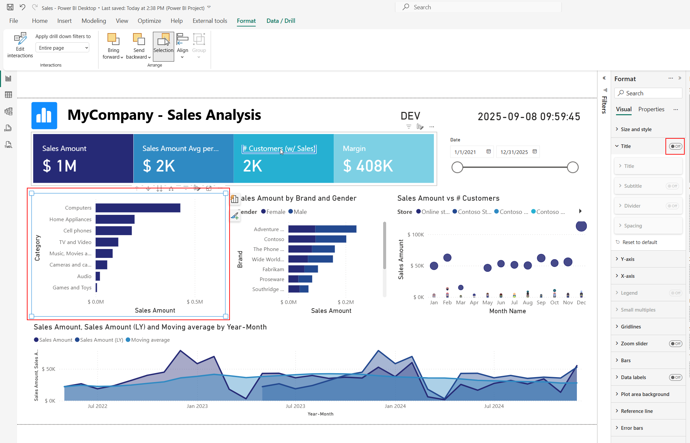
4. Open the **More options** menu in the top-right corner and select **Copy object name**
   
5. Save the PBIP.
6. Open **Visual Studio Code**
7. Go to **File > Open Folder...** and open the PBIP folder.
8. Right-click the `Sales.Report` folder, select **Find in folder** and paste the  report object name.
   
   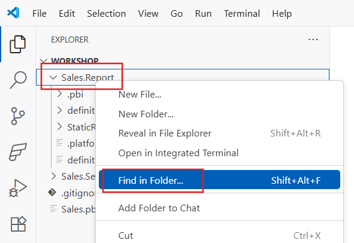

   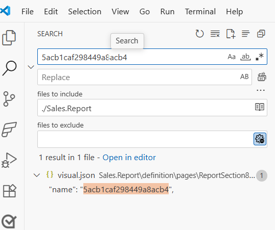
   
9. Open the matched file for edit.
10. Mouse-hover the `height` property and notice that **Visual Studio Code** shows a tooltip that explains the property.

    

    This is because PBIR JSON files include a JSON schema declaration at the top of the document with the `$schema` property. Additionally, it provides built-in IntelliSense and validation when editing with code editors like Visual Studio Code.

    If you misspell a property name, the code editor will flag the error and show an explanatory tooltip or entry in the Problems pane:

    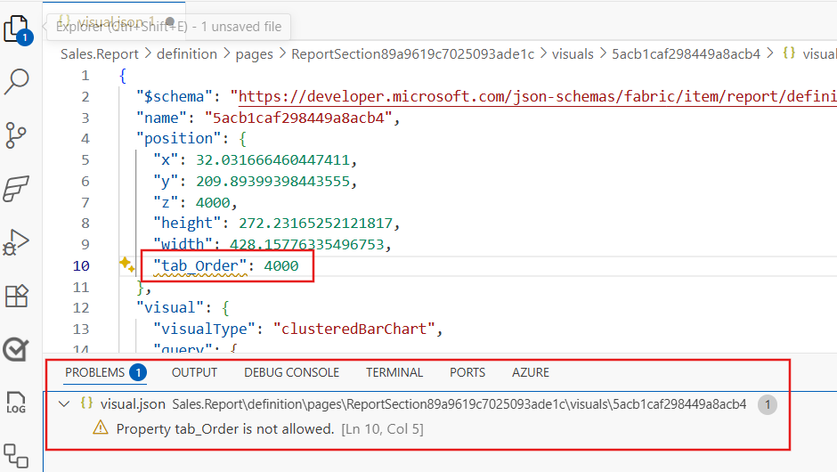

    Learn more about PBIR schemas in [documentation](https://learn.microsoft.com/en-us/power-bi/developer/projects/projects-report?tabs=v2%2Cdesktop#pbir-json-schemas).

11. Navigate to the JSON property `visual.visualContainerObjects.title` and notice that the property `show`is configured as `false`. This is the configuration that determines that the visual title is hidden.

    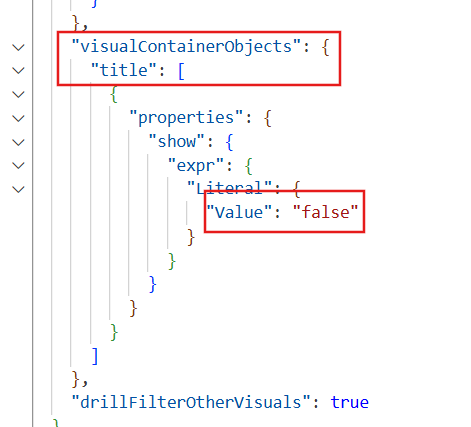

12. Close **Power BI Desktop**
13. Create a new **PowerShell** script file named `HideVisualTitles.ps1` side by side with the `Sales.pbip`.

    ```text
    PBIP/
    ├── Sales.Report/
    ├── Sales.SemanticModel/    
    ├── HideVisualTitles.ps1
    └── Sales.pbip
    ```

    Copy and paste the following PowerShell code to `HideVisualTitles.ps1`
    
    ```powershell
    $ErrorActionPreference = "Stop"

    $currentPath = (Split-Path $MyInvocation.MyCommand.Definition -Parent)

    $reportPath = "$currentPath\Sales.Report"

    $visualFiles = Get-ChildItem -Path $reportPath -Recurse -Include visual.json

    foreach ($file in $visualFiles) {       

        $json = Get-Content $file.FullName | ConvertFrom-Json

        write-host "Processing visual in file: $($file.FullName)"

        # If title show property exists, set it to 'false' if not create it. But its not guaranteed that the parent objects exist.

        $showProperty = $json.visual.visualContainerObjects.title.properties.show

        if ($showProperty)
        {
            $showProperty.expr.Literal.Value = "false"
        }
        else {        
            if (!$json.visual.visualContainerObjects)
            {            
                $json.visual | Add-Member -NotePropertyName "visualContainerObjects" -NotePropertyValue ([PSCustomObject]@{}) -Force
            }

            if (!$json.visual.visualContainerObjects.title)
            {  
                $json.visual.visualContainerObjects | Add-Member -NotePropertyName "title" -NotePropertyValue (@([PSCustomObject]@{"properties" = [PSCustomObject]@{}})) -Force
            }

            if (!$json.visual.visualContainerObjects.title.properties.show)
            {                 
                $json.visual.visualContainerObjects.title.properties | Add-Member -NotePropertyName "show" -NotePropertyValue ([PSCustomObject]@{
                "expr" =  [PSCustomObject]@{
                    "Literal" = [PSCustomObject]@{
                    "Value" =  "false"
                    }
                }
                }) -Force
            }

            $json.visual.visualContainerObjects.title.properties.show.expr.Literal.Value = "false"
        }

        $json | ConvertTo-Json -Depth 100 | Set-Content $file.FullName
    }

    ```
14. Click **Run** in the top-right to run the **PowerShell** script

    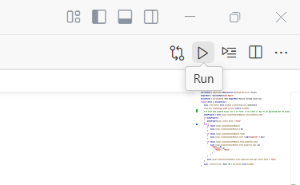

    The following output is expected:

    

15. Open the `Sales.pbip` with **Power BI Desktop** and notice that all visuals in all pages got the title hidden.

    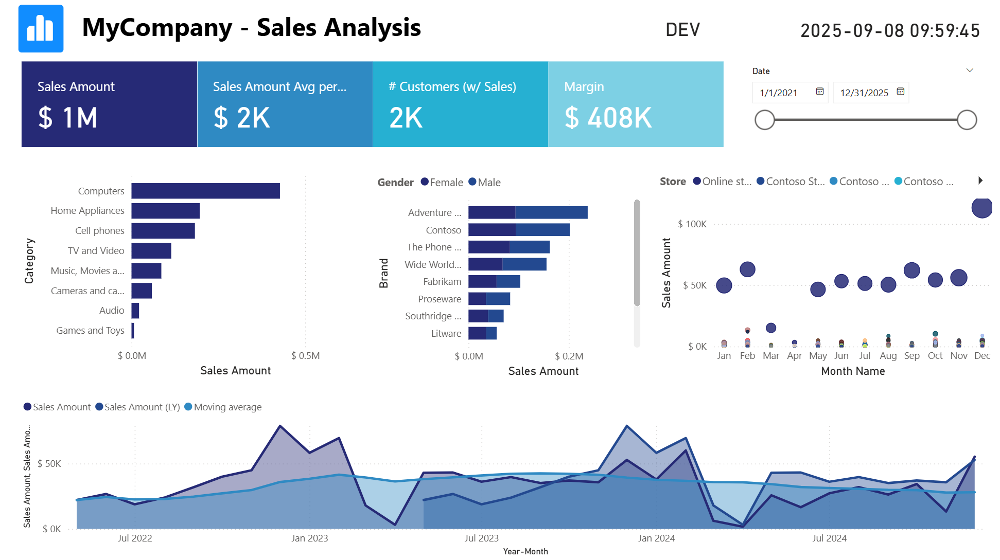

> [!IMPORTANT]
> This example is educational - it would have been more efficient to hide titles using multi-select on each page. However, if you needed to apply the same change across 50 reports with average of 10 pages each, automating it with a script like the one above and running it against all PBIR report files would be far more efficient.

## ✅ Wrap-up

You’ve now:

* Worked with PBIP and its folder structure
* Manipulated TMDL and PBIR file structures
* Granular deployment from Visual Studio Code
* Manual code edits over TMDL and PBIR files
* Batch changes with a script on top of a PBIR report

## Useful links

* [Power BI Project docs](https://learn.microsoft.com/en-us/power-bi/developer/projects/projects-overview)
* [TMDL language docs](https://learn.microsoft.com/en-us/analysis-services/tmdl/tmdl-overview?view=sql-analysis-services-2025)
* [Visual Studio Code basics](https://code.visualstudio.com/docs/introvideos/basics)
