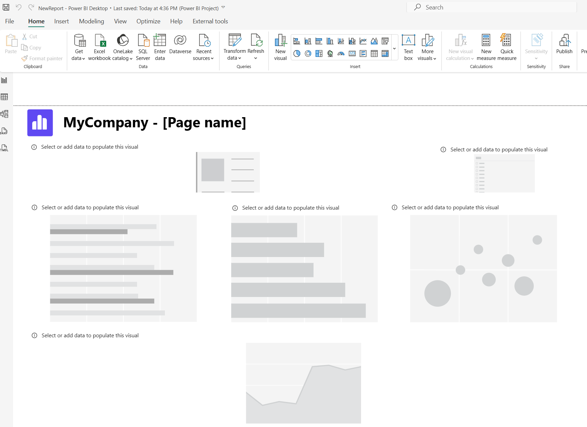
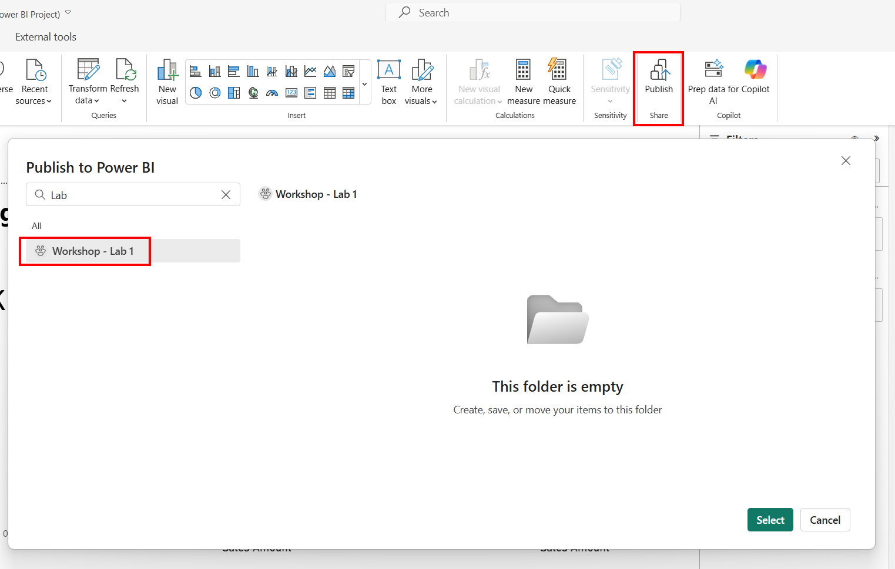
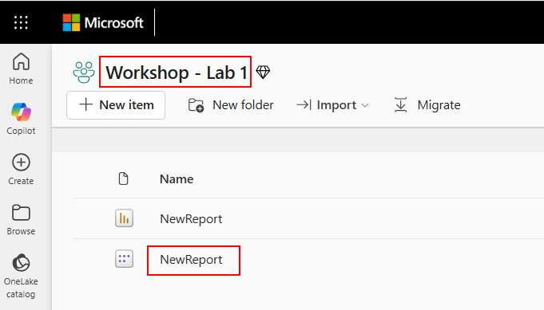
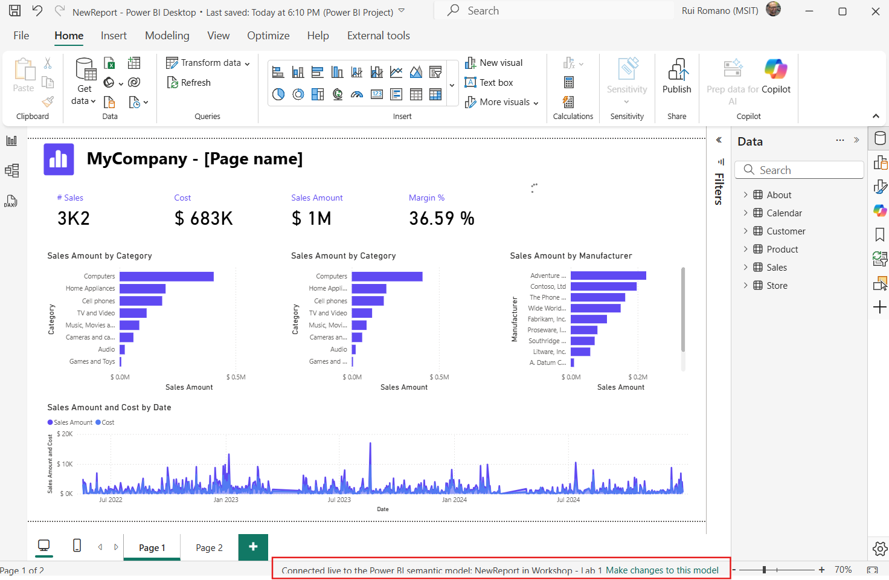
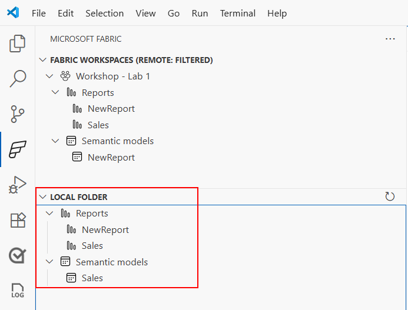
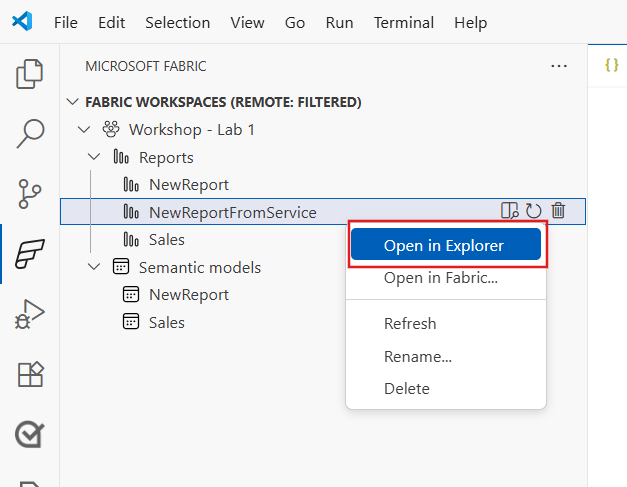

# Power BI Project (PBIP) fundamentals

Welcome to this lab where you'll get hands-on experience with the **Power BI Project (PBIP)** format. This workshop is designed to help you understand and manipulate the PBIP folder structure, publish to workspace and  working with **TMDL** and **PBIR** files.

## 🛠️ Prerequisites


* Enable the following Power BI Desktop preview features:
  * `Power BI Project (.pbip) save option`
  * `Store semantic model using TMDL format`
  * `Store reports using enhanced metadata format (PBIR)`
  
* Ensure you have the following Visual Studio Code extensions
  * [TMDL extension](https://marketplace.visualstudio.com/items?itemName=analysis-services.TMDL)
  * [Microsoft Fabric extension](https://marketplace.visualstudio.com/items?itemName=fabric.vscode-fabric)


## 1. Save a PBIX to PBIP Format

✅ **Goal**: Save your report as a PBIP project.

### Steps

1. Open [Sales.pbix](resources/Sales.pbix) in Power BI Desktop.
   
    > [!IMPORTANT]
    > This PBIX file uses mock data sourced from CSV files hosted in a public location. When prompted for authentication, select **Anonymous** - the data should refresh without any errors.

2. Go to **File > Save As**.
3. Choose a folder (e.g. `c:\temp\workshop\pbip`) and select **Save as type**: `Power BI Project Files (*.pbip)`
4. Name it: `Sales.pbip`
5. Power BI Desktop now saves your work as a PBIP folder instead of a single PBIX file.
6. You can recognize a Power BI Project by the **expanded title bar** in Desktop, which allows you to identify and open the associated folder directly in Windows Explorer.

    
7. Although Power BI Desktop presents the experience as if you're working with a single file, you're actually editing two distinct components: the report and the semantic model, each stored in its own folder within the PBIP structure.
   
    ```text
    PBIP/
    ├── Sales.Report/
    ├── Sales.SemanticModel/
    ├── .gitignore
    └── Sales.pbip
    ```

## 2. Explore PBIP files and folders

✅ **Goal**: Understand how Power BI Project is organized and its key files and folders.

### Steps

1. Open Visual Studio Code
2. Go to **File > Open Folder...** and open the saved PBIP folder.
3. Open and explore the following key files and folders:
   * `*.pbip` - Main entry point file for Power BI Desktop. Notice that it includes a reference to the Report folder. **It's optional** file, Power BI Desktop can also open a report for edit by opening the `definition.pbir`.
   * `*.Report/definition.pbir` - Contains the overall report definition and key configuration settings such as folder version. Most importantly, it includes a reference to the **semantic model** — typically via a **relative `byPath` reference**, though it can also use an **absolute `byConnection` reference** to connect to a semantic model hosted in a Fabric workspace.
   * `*.Report/definition` - Contains the report definition in [**PBIR format**](https://learn.microsoft.com/en-us/power-bi/developer/projects/projects-report?tabs=v2%2Cdesktop#pbir-format), where each component - such as pages, visuals, bookmarks, etc. - is organized into its own **folders** and **JSON files**.
   * `*.SemanticModel/definition` - Contains the semantic model definition in [**TMDL file format**](https://learn.microsoft.com/en-us/power-bi/developer/projects/projects-dataset#tmdl-format), where each component - such as tables, roles, cultures, etc. - is organized into its own **folders** and **TMDL documents** using [**TMDL language**](https://learn.microsoft.com/en-us/analysis-services/tmdl/tmdl-overview?view=sql-analysis-services-2025).
   * `*.SemanticModel/.platform` - Fabric platform file for the semantic model and report, containing properties such as `displayName`, `description`, and `logicalId` (required for deployment and Fabric Git integration). 
   * `*.Report/.platform` - Same as semantic model `.platform` file but the `displayName` property is used  to define Power BI Desktop window title name.      
   * `*.SemanticModel/.pbi/cache.abf` - A **local cached copy** of the semantic model’s data is stored as an Analysis Services Backup File (ABF). This file acts as a **user-specific cache** and **should not be shared** among Power BI developers when using Git. Power BI Desktop can open a PBIP project without the `cache.abf` file, but the semantic model will be empty, and a data refresh may be required to test or view the report properly.
  
    > [!IMPORTANT]
    > All files and folders are documented in [PBIP documentation](https://learn.microsoft.com/en-us/power-bi/developer/projects/projects-overview) including references to their public [JSON-schemas](https://github.com/microsoft/json-schemas/tree/main/fabric). 
  

## 3. Create new report from a template

✅ **Goal**: Create a new report from another report template folder using PBIR file format and edit report files.

### Steps

1. Copy the [`resources/templateReport`](resources/templateReport/) folder to the previously saved PBIP folder and rename the folder to `NewReport.Report`
   
   You should end up with a folder structure like:

    ```text    
    PBIP/
    ├── NewReport.Report/
    ├── Sales.Report/
    ├── Sales.SemanticModel/
    ├── .gitignore
    └── Sales.pbip
    ```

    > [!TIP]
    > The template report uses descriptive folder names for pages and visuals. By default, new items like pages are saved with unique IDs by Power BI Desktop, but you can rename these folders to use meaningful names for easier navigation and management.

2. Ensure the `NewReport.Report/definition.pbir` has a valid relative reference to `Sales.SemanticModel` in the `byPath` property. 

    > [!TIP]
    > The PBIP format supports multiple reports and semantic models within a single folder, similar to a Fabric workspace. You can manage several reports and models together, and it's not necessary to have a separate `.pbip` file for each report - each report can be opened directly from its `.pbir` file inside its respective report folder.
   
3. Choose a theme file from [`resources/themes`](resources/themes/) and copy its contents into `NewReport.Report/StaticResources/RegisteredResources/theme.json` file within your new report folder.
4. Open `NewReport.Report/definition.pbir` with Power BI Desktop
5. Since this is a template report, it contains placeholder visuals. But also opens the **Sales** semantic model for editing.
   
6. Configure the visual placeholders with semantic model fields and build a report similar to the following:
   
7. Observe it's using the colors of the theme you picked.
    > [!TIP]
    > One of the key benefits of the PBIP format is the ability to customize reports, pages, or visuals using straightforward file operations before opening them in Power BI Desktop. This makes it easy to create reusable templates for your development workflows.
8. Save the report in Power BI Desktop, observe that `.platform` file is automatically generated in the report folder.
9.  Create a new page with some visuals, save your changes, and observe that a new page folder is created inside the report `definition` folder.

## 4. Connect a report to a semantic model in service

✅ **Goal**: Publish PBIP from Power BI Desktop and connect report to semantic model in workspace.

### Steps

1. Create a new workspace in Fabric, give it a name like `Workshop - Lab 1`
2. Publish the new report to the workspace using Power BI Desktop **Publish** option.
   
3. The workspace should now have a new report and semantic model inside.
   
> [!TIP]
> Notice that the semantic model was published with same name of the report even though the semantic model `.platform` file has a different `displayName`. This is by-design because currently Power BI Desktop **Publish** operation is using a PBIX behind the scenes. 

4. Open the workspace and grab the following attributes:
    * Workspace and semantic model names
        
    * Semantic model ID
    
5. Go back to Visual Studio Code and create a new file `definition-live.pbir` inside `NewReport.Report/` folder with the following content:
   
    Replace the placeholders `[WorkspaceName]`, `[SemanticModelName]` and `[SemanticModelId]` with the attributes from previous step.

    ```json
    {
        "$schema": "https://developer.microsoft.com/json-schemas/fabric/item/report/definitionProperties/2.0.0/schema.json",
        "version": "4.0",
        "datasetReference": {
            "byConnection": {      
                "connectionString": "Data Source=\"powerbi://api.powerbi.com/v1.0/myorg/[WorkpaceName]\";initial catalog=[SemanticModelName];access mode=readonly;integrated security=ClaimsToken;semanticmodelid=[SemanticModelId]"
            }
        }
    }
    ```

    The report folder should now include two `*.pbir` files:

    ```text    
    PBIP/
    ├── NewReport.Report/
    |   ├── definition/
    |   ├── definition-live.pbir
    |   └── definition.pbir
    ```

> [!TIP]
> * `byConnection` Specifies a connection to a semantic model in a Fabric workspace by using a connection string. When a byConnection reference is used, Power BI Desktop open the report in **Live Connect** mode therefore the semantic model is not opened for edit.
> * More details about `definition.pbir` file in [documentation](https://learn.microsoft.com/en-us/power-bi/developer/projects/projects-report?tabs=v2%2Cdesktop#definitionpbir).

6. Open the `definition-live.pbir` with Power BI Desktop and notice that now the semantic model is not opened for edit but instead the report is **Live Connected** to the semantic model in the Fabric workspace.

    

> [!TIP]
> Including multiple *.pbir files is especially useful when switching between a local semantic model and a published one, allowing flexibility in development and testing. 
    
## 5. Copy semantic model objects using TMDL files

✅ **Goal**: Create a time intelligence calculation group by copying the TMDL file to the semantic model definition.

### Steps

1. Copy the [`resources/tmdl/Time Intelligence.tmdl`](resources/tmdl/Time%20Intelligence.tmdl) TMDL file to the `Sales.SemanticModel\definition\tables` folder.
2. If you currently have Sales.pbip open in Power BI Desktop, please close it.
> [!TIP]
> Currently, Power BI Desktop does not detect changes made to PBIP files using external tools or code editors. If you modify any PBIP file and want to see those changes reflected in Power BI Desktop, you must close and reopen the PBIP project.
3. Open `Sales.pbip` in Power BI Desktop and verify that the semantic model now includes the new **Time Intelligence** calculation group table. A refresh may be required.
   
   
   
> [!TIP]
> The **TMDL folder structure makes it easy to reuse and collaborate on semantic models**. You can maintain shared model components (e.g. calendar tables, calculation groups, roles,...) and quickly apply them to multiple semantic models by copying files between definitions.

## 6. Publish from Visual Studio Code

✅ **Goal**: Publish report and semantic model from Visual Studio Code using [Microsoft Fabric extension](https://marketplace.visualstudio.com/items?itemName=fabric.vscode-fabric).

### Steps

1. Open Visual Studio Code and navigate to the **Microsoft Fabric extension**.
   

> [!TIP]
> You can use the [**Switch tenant**](https://github.com/microsoft/vscode-fabric?tab=readme-ov-file#switch-tenants) feature to force a specific account.

2. Filter the workshop workspace.
    
    

3. Explore the items in the workspace in Visual Studio Code
   
   

4. Go to **File > Open Folder...** and open the saved PBIP folder.
5. In the Microsoft Fabric extension, expand the "Local folder" node and confirm that each Report (*.Report) and SemanticModel (*.SemanticModel) folder from your PBIP folder is listed in the tree-view.
   
   

6. Right-click the `Sales` semantic model, select **Publish > To specific workspace...** and pick a Fabric workspace - the filtered workspace should appear in the top.
   
   
   
   

    Look for the operation status in the bottom right corner:

    

7. Confirm if the semantic model got published to the workspace.
8. Repeat the publish operation for the Report. 
   
    Power BI reports must be connected to a semantic model; during publishing the process prompts to select the target semantic model in the workspace that the report will connect to.

   

> [!TIP]
> By default the extension show all the semantic models in the selected workspace, but you have the option to select to a semantic model in a different workspace.

> [!IMPORTANT]
> * When you publish from Visual Studio Code, the **Microsoft Fabric extension only publishes the definition (metadata)** - it does not publish the semantic model data. The extension uses the [Fabric REST CRUD APIs](https://learn.microsoft.com/en-us/rest/api/fabric/articles/item-management/item-management-overview) to deploy the PBIP semantic model or report definition files. 
>* This approach not only gives you flexibility in choosing what to publish - whether just the report or only the semantic model - but also significantly **boosts development efficiency**. For example, when making a simple update like fixing a DAX measure, you can skip publishing both metadata and data, and avoid waiting for a semantic model refresh in the service.
 
## 7. Get item definition from workspace using Visual Studio Code

✅ **Goal**: Download item definitions from workspace.

### Steps

1. Open the workshop workspace in Fabric.
2. Create a new report from a semantic model in the workspace.
   
3. Save the report and name it `NewReportFromService`
4. Open **Microsoft Fabric extension** in Visual Studio Code and navigate to the workspace.
5. Right-click the report `NewReportFromService` and select **Open in Explorer**
   
6. If successfull, Visual Studio Code will open the downloaded item folder
7. Go to windows explorer and open the `NewReportFromService.Report/definition.pbir` file with Power BI Desktop
   
> [!TIP]
> By design when downloading the definition of a report, it always downloads with a `byConnection` configuration in `definition.pbir` but you can easily change it to a `byPath` targeting a local semantic model folder.

8. Repeat the previous steps, now to download a semantic model from a workspace.

> [!IMPORTANT]
> **This download item approach offers significant usability benefits, especially when you need to retrieve the definition of a report or semantic model that is blocked by the standard [Download PBIX feature](https://learn.microsoft.com/en-us/power-bi/create-reports/service-export-to-pbix)**. Unlike the PBIX download, which has limitations - such as not supporting semantic models with incremental refresh - this method is not restricted by those constraints and allows for more flexible access to report components.

## 8. Edit semantic model using TMDL

✅ **Goal**: Edit a semantic model using code and TMDL language.

### Steps

1. Close Power BI Desktop
> [!TIP]
> Power BI Desktop does not detect changes made to PBIP files.
2. Open **Visual Studio Code**
3. Go to **File > Open Folder...** and open the PBIP folder.
4. Open file `Sales.SemanticModel/definition/tables/Sales.tmdl`
5. 
6. Open 
7. 
    - extension
    - lineage tag resolution with code actions
    - bread crumb
    - Intellisense including DAX & PQ
  
## Edit PBIR files

✅ **Goal**: Edit a report using code and PBIR file format.

### Steps

    - Schemas
    - Identify visual file in the files with Copy Report Object name
    - Script for batch edit - optional
    - ...


## ✅ Wrap-up

You’ve now:

* Worked with PBIP and its folder structure
* Manipulated TMDL and PBIR file structures
* Granular deployment from Visual Studio Code
* Code edits over TMDL and PBIR files for efficiency

## Useful links

* [Power BI Project docs](https://learn.microsoft.com/en-us/power-bi/developer/projects/projects-overview)
* [Visual Studio Code basics](https://code.visualstudio.com/docs/introvideos/basics)