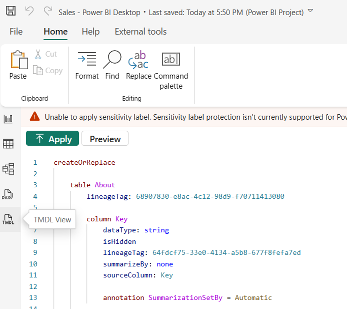
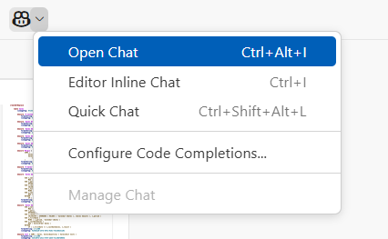
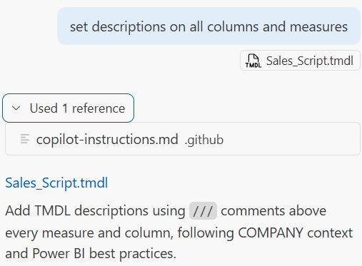
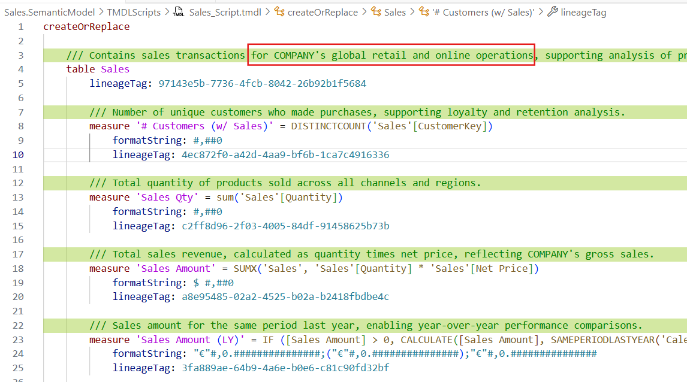
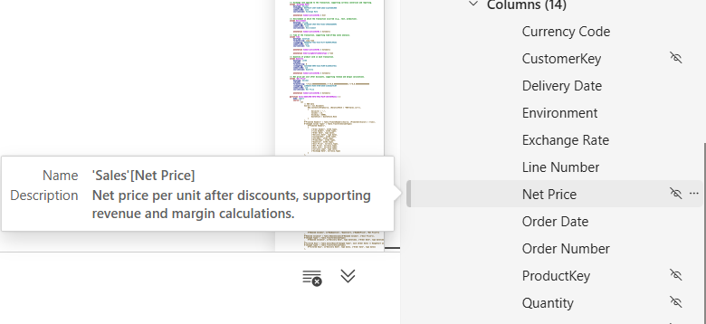
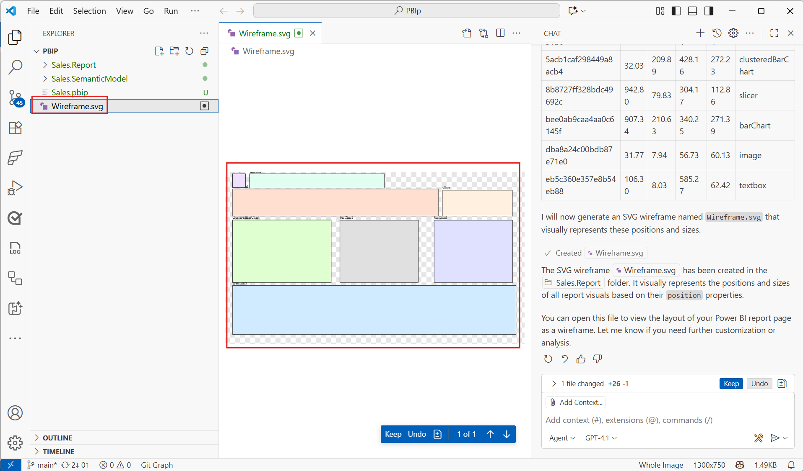
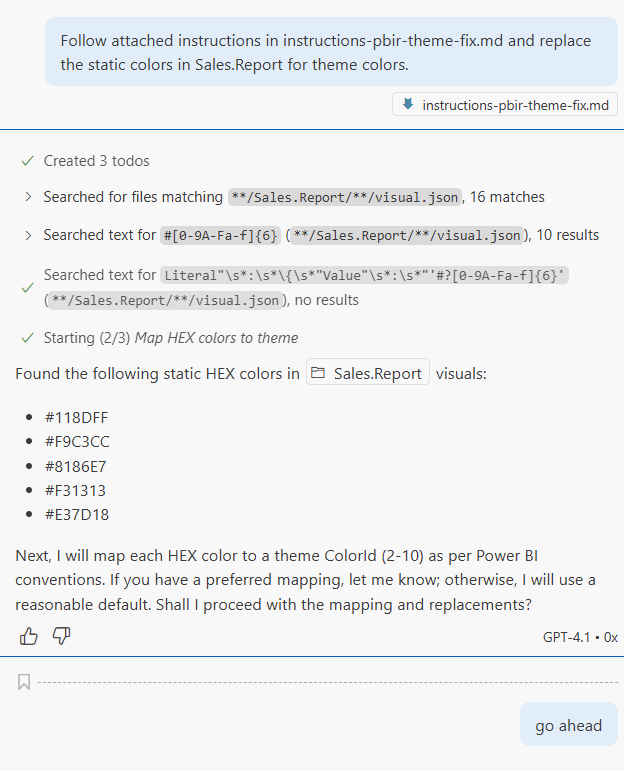

# Power BI Project (PBIP) and AI

This lab shows how AI can assist in your Power BI development - whether it's using AI chats to modify a TMDL script and apply it back to the semantic model, or leveraging AI agents to understand and update your Power BI Project files.

## 🛠️ Prerequisites

* Enable the following **Power BI Desktop** preview features:
  * Power BI Project (.pbip) save option
  * Store semantic model using TMDL format
  * Store reports using enhanced metadata format (PBIR)
* Ensure you have the following Visual Studio Code extensions
  * [TMDL extension](https://marketplace.visualstudio.com/items?itemName=analysis-services.TMDL)
  * [GitHub Copilot](https://marketplace.visualstudio.com/items?itemName=GitHub.copilot)
  * [GitHub Copilot chat](https://marketplace.visualstudio.com/items?itemName=GitHub.copilot-chat)
* GitHub Copilot subscription, sign up for a trial [here](https://github.com/github-copilot/pro).

## 1. Explore TMDL view

✅ **Goal**: Get confortable with **TMDL view**.

### Steps

1. Open [Sales.pbix](../lab2/resources/Sales.pbix) in **Power BI Desktop**.
> [!IMPORTANT]
> It's a different PBIX from **lab1**.
1. Go to **File > Save As**, 
2. Choose a folder (e.g. `c:\temp\lab2`) and select **Save as type**: `Power BI Project Files (*.pbip)`
3. Name it: `Sales.pbip`
4. Open **TMDL view** tab
    
    
5. Script the expression `Environment` which is a Power BI parameter by dragging it from the model explorer to the code editor.
    
    
6. Change the current value of the expression from "DEV" to "PRD"
   
   The script should look like this:

   ```tmdl
    createOrReplace

        expression Environment =
                "PRD" meta [
                    IsParameterQuery = true,
                    List = {"DEV", "QUAL", "PRD"},
                    DefaultValue = "DEV",
                    Type = "Text",
                    IsParameterQueryRequired = true
                ]
            lineageTag: 64edd943-1a90-4438-b62f-bb95a9da1510

            annotation PBI_ResultType = Text
   ```
7. Click **Preview** to display a code diff of the impact to the semantic model before executing the script.  
8.  Click **Apply** to apply the change to the semantic model 
> [!TIP]
> **TMDL view**, unlike PBIP, which follows a code-behind mental model, is based on a **scripting mental model**. In TMDL view, you execute TMDL scripts using the `createOrReplace` command to define or update one or more semantic model objects. This means that scripts created in TMDL view are not automatically updated when you make changes in Model view. This separation is useful - TMDL view can serve as a kind of backup mechanism: before applying a batch of changes to your semantic model, you can save a script version, and easily revert by reapplying that earlier script if needed.
9. Notice that you modified a Power Query expression (the expression parameter), Power BI Desktop did not forced a data refresh. This behavior can be very useful when you want to update model queries without triggering a local refresh immediately.

10. Copy the TMDL script from the [Time intelligence calculation group](https://community.fabric.microsoft.com/t5/TMDL-Gallery/Time-intelligence-calculation-group/td-p/4770878) **TMDL Gallery** entry and paste it on a new **TMDL view** tab.

11. Execute the script and notice that a new calculation group `Time Intelligence` got created.
    
> [!TIP]
> * **TMDL view** can be very useful to easily share semantic model objects between developers. Either from public galleries but also from internal locations such as BI team SharePoint site.

12. Save your PBIP, open the PBIP with **Visual Studio Code** and notice that all the TMDL scripts you create get saved in the `Sales.SemanticModel/TMDLScripts` folder.

Learn more about **TMDL view** in [documentation](https://learn.microsoft.com/en-us/power-bi/transform-model/desktop-tmdl-view).

## 2. Batch changes with TMDL view + GitHub Copilot

✅ **Goal**: Learn how to use TMDL view together with generative AI for batch edits for model documentation and measure generation.

### Steps

1. Open `Sales.pbip` in **Power BI Desktop**.
2. Using **TMDL view** script the table `Sales` and rename the script tab to `Sales_Script`
3. Save your PBIP
4. Open **Visual Studio Code** and the PBIP folder
5. Navigate to the TMDL script file `Sales.SemanticModel/TMDLScripts/Sales_Script.tmdl` 
6. Open [**GitHub Copilot chat**](https://docs.github.com/en/copilot/how-tos/use-chat/use-chat-in-ide) by clicking the Copilot icon next to the search bar or pressing `CTRL+SHIFT+I`
    
7. Ensure the mode is set to **Edit** to ensure that Copilot only edits the opened file.
   
8. Type `set descriptions on all columns and measures` and execute.
      
9.  **GitHub Copilot** may produce inaccurate or entirely incorrect TMDL scripts - such as the example below. This behavior is expected, as current Large Language Models (LLMs) do not yet fully understand the semantics of TMDL and its scripting language.  
        
10. Undo or don't accept **Copilot** changes to go back to the original version of the script.
11. Copy the file [`resources/copilot-instructions.md`](resources/copilot-instructions.md) into the `.github` directory within your PBIP folder.

    ```text
    PBIP/
    ├── .github/
    |   └── copilot-instructions.md
    ├── Sales.Report/
    ├── Sales.SemanticModel/        
    └── Sales.pbip
    ```    
> [!IMPORTANT]
> While you can improve **Copilot** output by making your prompts more specific, it requires you to remember to do so every single time. A more reliable approach is to include a custom instructions file in your project, which gives Copilot additional context about PBIP and TMDL.

12. Repeat **step #8** and notice the difference now with context file. 

    **Copilot** should tell you that is using `copilot-instructions.md` file as reference.

    

    And this time it should produce valid TMDL and following the guidelines in `copilot-instructions.md`. Notice how its using references to COMPANY details.

    

> [!TIP]
> Take a moment to review the `copilot-instructions.md` file and notice that we don't need to be very specific and its similar as explaining concepts to a colleague. 

13. Copy the TMDL script from **Visual Studio Code** and paste it back in **TMDL view** as a new tab.
14. Click **Apply** in TMDL view to run the script
15. Confirm that all columns and measures from the `Sales` table now have descriptions.

    
    
> [!IMPORTANT]
> **TMDL view** enables you to easily script objects from the semantic model into code that AI can manipulate. Understanding this is essential to unlocking your efficiency - because with the right context, you can achieve virtually anything. Moreover, the same principle applies directly to the PBIP TMDL files, allowing for seamless integration and automation at the file level.

16. Script `Product` table in **TMDL view** and rename the script tab to `Product_Script`
17. Open `Sales.SemanticModel/TMDLScripts/Product_Script.tmdl` with **Visual Studio Code**
18. Open **GitHub Copilot chat**, type `create base measures for columns` and execute.
    
    Notice that **Copilot** will create the measures respecting the guidelines of `copilot-instructions.md`

    


## 3. PBIR + GitHub Copilot

1. Open [Sales.pbip] in **Power BI Desktop**.
2. Swap the [Power BI theme](https://learn.microsoft.com/en-us/power-bi/create-reports/desktop-report-themes) to one of the themes available in [lab1/resources/themes](../lab1/resources/themes/).
   
   Notice that the bottom visuals do not change the colors, because this report is not following best practices of using theme colors.

   

3. Open **Visual Studio Code** and the PBIP folder
4. Open [**GitHub Copilot chat**](https://docs.github.com/en/copilot/how-tos/use-chat/use-chat-in-ide) by clicking the Copilot icon next to the search bar or pressing `CTRL+SHIFT+I`
5. Ensure the mode is set to **Agent** to ensure that Copilot has visibility and can edit the opened PBIP folder
   
> [!TIP]
> Learn about **Agent mode** where Copilot can analyze all your code folder and edit multiple files. Learn more about Agent mode in the [documentation](https://code.visualstudio.com/blogs/2025/02/24/introducing-copilot-agent-mode)
6. Type in the chat `Analyze the position property of the visual.json files of the Power BI report in Sales.Report folder and build a SVG wireframe with name 'Wireframe.svg'` and execute.
   
    **GitHub Copilot** will read all the visual.json position configuration and build a wireframe of the report as SVG:

    Example of `visual.json` position property:

    ```json
        {
            "$schema": "https://developer.microsoft.com/json-schemas/fabric/item/report/definition/visualContainer/2.1.0/schema.json",
            "name": "5acb1caf298449a8acb4",
            "position": {
                "x": 32.031666460447411,
                "y": 209.89399398443555,
                "z": 3000,
                "height": 272.23165252121817,
                "width": 428.15776335496753,
                "tabOrder": 2000
            }
            ...
        }
    ```
    

> [!TIP]
> Generating report wireframes can be extremely helpful for documentation or diagnosing performance issues.

7. Now let’s use **GitHub Copilot** to fix our report by resetting all visuals to use theme colors instead of static hex codes, which, as you observed, don’t automatically adapt to new report themes.
8. In **GitHub Copilot** chat, click on **Attach Context** and select the file [`resources/instructions-pbir-theme-fix.md`](resources/instructions-pbir-theme-fix.md). You can also drag-drop the file to the chat.
9. Close all opened files in **Visual Studio Code**
10. Type in the chat `Follow attached instructions in instructions-pbir-theme-fix.md and replace the static colors in Sales.Report for theme colors.` and execute.
    
    

    **GitHub Copilot** should replace all the HEX colors for a theme color, and it may prompt you to review the mapping.

    

    

11. Close **Power BI Desktop**
12. Open `Sales.pbip`
13. Confirm that now all visuals are using theme colors, try to change the theme and notice that colors change.
> [!TIP]
> This is a simple, educational example with a small report - and doing it manually would have been easier. But the same approach scales to 100+ reports with +10 pages each, where automation really pays off. 

## ✅ Wrap-up

You’ve now:

* Learned how to use easily use AI chats to support your semantic model development together with **TMDL view**.
* Learned how to use **GitHub Copilot Agent mode** to inspect and modify your Power BI project files.

## Useful links

* [TMDL view docs](https://learn.microsoft.com/en-us/power-bi/transform-model/desktop-tmdl-view)
* [GitHub Copilot Overview](https://code.visualstudio.com/docs/copilot/overview)
